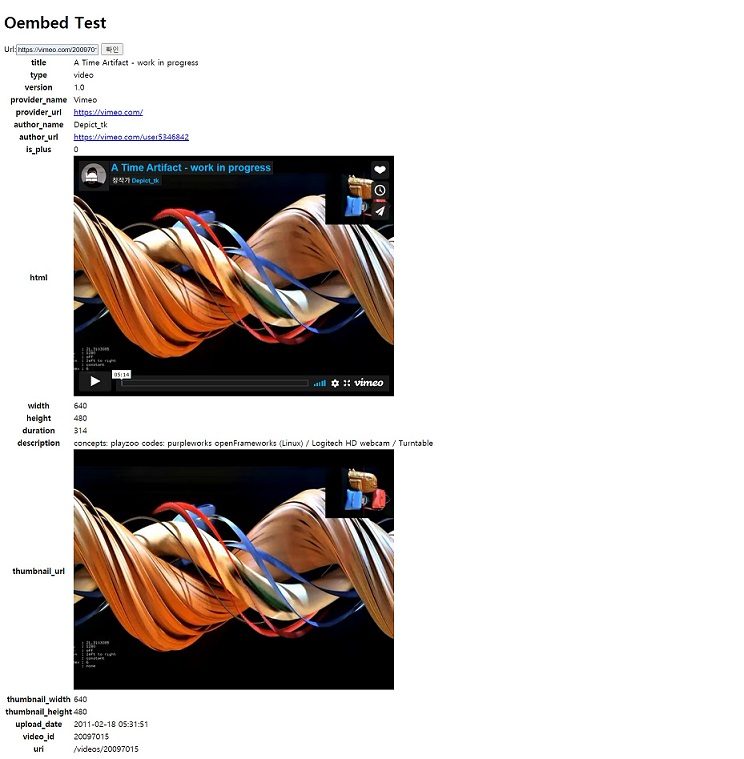

# oEmbed Test

### Django, [oEmbed](https://oembed.com/) 를 이용하여 요청한 사이트의 embedded  content 랜더링

#### 실행
```shell
# 소스코드 받은 후
sudo docker build -t oembed-test .

sudo docker run -p 8000:8000 oembed-test

# 또는

sudo docker run -p 8000:8000 gptjddl123/oembed
```

http://127.0.0.1:8000
에 접속하여 url 입력.

예시

```https://vimeo.com/20097015``` 입력



#### 구현

> - url 입력 받음
> - url 유효성 체크 (model Form) ("https://*.*" 형식 확인)
> - url 이 "https://oembed.com/providers.json" 에 등록된 scheme 패턴에 매칭되는지 확인
> - 해당하는 base_url 을 이용하여 endpoint url 생성
> - json response 리턴

```python
# oembed/views.py

def get_json(url):

    domain = extract_domain(url)
    if "www" in domain:
        domain = domain.replace("www.", "")
    domain_name = domain.split('.')[0]

    json_url = "https://oembed.com/providers.json"
    json_data = requests.get(json_url).json()

    for item in json_data:

        for endpoint in item["endpoints"]:

            if "schemes" not in endpoint:
                continue
                
            for scheme in endpoint['schemes']:
                scheme = scheme.replace('?', '\?')

                pattern = scheme.replace('*', r'[^\*&]+?')  # 패턴 매칭
                # print(pattern)
                if re.findall(pattern, url):  # url 이 매칭되는 패턴이 있다면
                    base_url = endpoint['url']

                    # only instagram (token 인증 해야함)
                    if domain_name == "instagram":
                        return requests.get("https://graph.facebook.com/v10.0/instagram_oembed?"
                                            "format=json&url={}&access_token={}".format(url, access_token)).json()

                    if ".{format}" in base_url:  # vimeo
                        base = base_url.replace("{format}", "json")
                        endpoint = base + "?url=" + url

                    else:
                        endpoint = base_url + "?format=json&url=" + url
                    try:
                        return requests.get(endpoint).json()

                    except JSONDecodeError:
                        return {"error": "해당 url 은 유효하지 않습니다."}

    else:
        return {"error": "해당 url 은 oEmbed 에 등록되어있지 않습니다."}
```